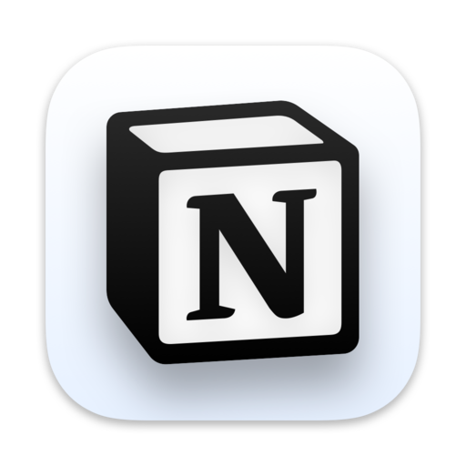

# Notion for Linux (Electron App)



I recently switched to Ubuntu and noticed there wasn't an official Notion desktop application for Linux. Given that I use an enterprise account with sensitive data, I decided to build my own secure Notion app using Electron, and I'm sharing it with you all to use. If you encounter any issues, please let me know, and I'll do my best to assist you professionally.

## ✨ Features

* **Secure & Official**: Wraps the official Notion web application, ensuring your sensitive enterprise data remains secure as it's the official web client running within Electron.
* **Native-like Experience**: Provides a desktop-like experience on Linux, separate from your web browser.
* **Customizable**: Built with Electron Forge, allowing for easy customization of app name, icon, and more.
* **Lightweight**: Focuses on delivering Notion without unnecessary overhead.

## 🚀 How to Install

Follow these steps to install the Notion Electron app on your Debian/Ubuntu-based system:

1.  **Download the latest `.deb` package**:
    Go to the [Releases](https://github.com/notyorch/Notion-for-Linux/releases) section of this repository and download the most recent `.deb` file.

2.  **Open your terminal**:
    Navigate to the directory where you downloaded the `.deb` file (e.g., `cd ~/Downloads`).

3.  **Install the application**:
    Use `dpkg` to install the package, and `apt-get -f install` to resolve any missing dependencies.

    ```bash
    sudo dpkg -i notion_1.0.0_amd64.deb # Replace with the actual filename if different
    sudo apt-get install -f
    ```

4.  **Launch Notion**:
    Once installed, you can find "Notion" in your applications menu and launch it like any other desktop application.

## 🛠️ How to Build from Source (for Developers)

If you wish to build the application yourself or contribute, follow these steps:

1.  **Clone the repository**:
    ```bash
    git clone [https://github.com/notyorch/Notion-for-Linux.git](https://github.com/notyorch/Notion-for-Linux.git)
    cd Notion-for-Linux
    ```

2.  **Install dependencies**:
    ```bash
    npm install
    ```

3.  **Run the app in development mode**:
    ```bash
    npm start
    ```

4.  **Package the app for distribution (e.g., `.deb`)**:
    ```bash
    npm run make
    ```
    The `.deb` file will be generated in the `out/make/deb` directory.

## 🤝 Contributing

Contributions are welcome\! If you have suggestions, bug reports, or want to improve the code, feel free to open an issue or submit a pull request.

## ✉️ Connect with me

<p align="left">
  <a href="https://www.linkedin.com/in/jorgeenriquevp/" target="_blank">
    
  </a>
</p>

---

**Disclaimer**: This is an unofficial Electron wrapper for Notion and is not affiliated with or endorsed by Notion Labs, Inc.
