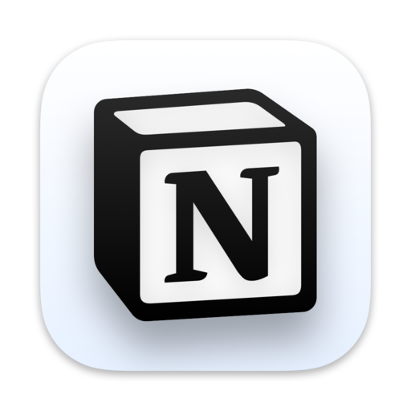

# Notion for Linux (Electron App)



Unofficial Notion desktop client for Linux, built with Electron Forge.

## Features

* Wraps the official Notion web app in a native Linux desktop shell.
* Supports Debian/Ubuntu, Fedora/RHEL, and universal AppImage packaging.
* Uses a hardened Electron runtime with native menus and saved window state.

## Installation


### Build packages from source

```bash
npm run make:deb
npm run make:fedora
npm run make:appimage
```

To build all supported formats:

```bash
npm run make:all
```

### Distro compatibility

| Format | Recommended distros | Notes |
| --- | --- | --- |
| `.deb` | Ubuntu, Debian, Linux Mint | Best fit for Debian-based systems |
| `.rpm` | Fedora, RHEL, CentOS Stream, openSUSE | Best fit for RPM-based systems |
| `.AppImage` | Any modern Linux distribution | Portable, no install required |

## Build from source

```bash
git clone https://github.com/notyorch/Notion-for-Linux.git
cd Notion-for-Linux
npm install
npm start
```

## Repository

* GitHub: https://github.com/notyorch/Notion-for-Linux

## Disclaimer

This is an unofficial Electron wrapper for Notion and is not affiliated with or endorsed by Notion Labs, Inc.
